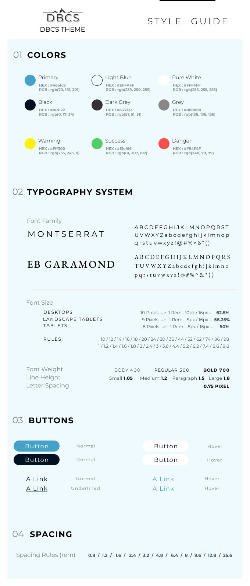

<div align="center">

  <p>An helper to implement the codebase of a PHP Framework following the MVC pattern</p>

</img>

  <h1 align="center">Aimer le sport par le coaching</h1>
  <br>
  <br>

</div>

## Table of Contents

- [Table of Contents](#table-of-contents)
- [Getting Started](#getting-started)
  - [Config constants to change](#config-constants-to-change)
  - [Change the .htaccess file](#change-the-htaccess-file)
- [Structure](#structure)
- [Start building your project](#start-building-your-project)
- [Branding and style guide](#branding-and-style-guide)
- [The Project](#the-project)
  - [javascript](#javascript)
  - [backend](#backend)

## Getting Started

1. **Download the Zip folder** and extract it on your machine.
2. **Put the folder on the `directory/www`** of your Wamp setup.
3. **Create a quick Database** on `phpMyAdmin`
4. **Add your constants variables** on the `config/` folder.
5. **Change the `.htaccess` file**: name your project and put that name to the .htaccess file in the `public/` folder
6. **Launch your localhost from WAMP**

<br>
<br>

### Config constants to change

These constants are to been update with your project.
You will find them on **the `app/config/config.php` file**.

```php
// DB Params
define('DB_HOST', 'localhost');
define('DB_USER', '_YOUR_USERNAME_');
define('DB_PASS', '_YOUR_PASSWORD_');
define('DB_NAME', '_YOUR_DBNAME_');

// App root
define('APP_ROOT',dirname(dirname(__FILE__)));

// URL root
define('URL_ROOT', '_YOUR_URL_');

// Site name
define('SITE_NAME', '_YOUR_SITE_NAME_');
```

<br>
<br>

### Change the .htaccess file

This is **the `.htaccess` file** you have to update to your name project folder.
You will find it, with **the following path, on the `public/.htaccess` file**.

You have **to switch `<YOUR_NAME_FOLDER>` by what's your app main project's name** is.

```
  RewriteBase /<YOUR_NAME_FOLDER>/public
```

<br>
<br>
<br>

## Structure

This helper is implemented with this clean and simple files's architecture.

```sh
app/
├── config
│   └── config.php
├── controllers
│   └── Pages.php
├── helpers
├── lib
│   ├── Controller.php
│   ├── Core.php
│   └── Database.php
├── models
├── views
│   ├── inc
│   |   ├── footer.php
│   |   └── header.php
│   └── pages
│       ├── about.php
│       └── index.php
├── .htaccess
└── bootstrap.php
public/
├── css
│   └── styles.css
├── images
├── js
│   └── main.js
├── .htaccess
└── index.php
.htacccess
README.md

```

<br>
<br>
<br>

## Start building your project

_In this section, I will document how to create your database, the models related to your project and so on._

To be continued...

<br>
<br>
<br>

---

## Branding and style guide

A standard style guide is made on purpose to referr to it, the website will evolve, closed to the customer, and we will of course make some changes as long as we build that project.



> **NOTICE:**
> We do not go in depth on that topics because of time and effort but we could definitivetly add more content, and context such as 'tags, logos, icons' or 'personas', customers potential...

## The Project

#### global scope

A simple app web site for a professional personal trainer which is trying to build his own enterprise. The needs are basic and we've focused more time and effort on the way to manage customers, partners and contacts in general.

The blog part will be used mor as a way to make some partners, helping them to increase their visibility, letting the client publish their content and redirect customers to their web sites...

On this way, the client do not make some big effort to publish some new contents and can like so, stay focus on his list of customers, prospects, partners or contacts...

#### javascript

You will find as well on the UI and "Views" side some of Javascript modules or library used to animate or some functionalities closed to the Js part of an application such as DataTables.js, scrollTrigger.js or stickyHeader.js...

I decide as well **in javascript to focus on a simple Modules architecture organization** without following the OOP standard paradigm. That's only my decision in that project which, of course, could be definitively done in another way.

There's also an helper folder to add some tiny functions..

### backend

For this simplifyed project, I decide to use a MVC Architecture with PHP & MySQL as database.

I've simplifyied the back office for purpose.
It's a "volunteer project" for a professional which have some simple needs and we both definitively agree that it will be not a special requirement, and need for his activity.

The project will grow with time and this MVC architecture allows us to do so...
