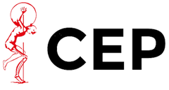
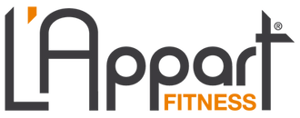

<div align="center">
  
  <br>
  <br>
  
  

</div>

# **Content & recommandation**

## Table of contents

- [**Content & recommandation**](#content--recommandation)
  - [Table of contents](#table-of-contents)
  - [About DBCS](#about-dbcs)
  - [**Header and Footer**](#header-and-footer)
    - [**Header**](#header)
      - [**Primary Navigation**](#primary-navigation)
    - [**Footer**](#footer)
  - [**Headings and texts titles**](#headings-and-texts-titles)
  - [**Sections**](#sections)
  - [**Sections content**](#sections-content)
    - [How DBCS works](#how-dbcs-works)
    - [Diets and the sport](#diets-and-the-sport)
      - [Sample meals](#sample-meals)
      - [Diets list](#diets-list)
    - [Tesimonial](#tesimonial)
      - [Images Gallery](#images-gallery)
      - [Customers's testimonials](#customerss-testimonials)
    - [Pricing plans](#pricing-plans)
      - [**Card Starter**](#card-starter)
      - [**Card Intermediate**](#card-intermediate)
      - [**Card Best Offer**](#card-best-offer)
    - [CTA contact card](#cta-contact-card)
  - [**Assets**](#assets)
    - [**Logos**](#logos)
      - [Main logo](#main-logo)
      - [Logos-partners](#logos-partners)
    - [Images](#images)
    - [Icons](#icons)
    - [Posts](#posts)
  - [**Additional links and pages**](#additional-links-and-pages)
    - [New Pages and Content to provide](#new-pages-and-content-to-provide)

<br>
<br>
<br>

---

## About DBCS

"DBCS Blog" is a **multipages website for a personal trainer**. You will find here the code's base starter created for this project.

A **real & volunteer professional project for a trainer wishing to start up his own business in September 2022.** It does not have any big request for his online business, but just having a website to work with.

The client will start his business with a tiny network and lot of experience in personal training. He would like to grow up with his own expertise as a freelance to get more independency.

**The content and the work you will find here on that repository will not be the final state of the project.** That's just a kind of demo, to be approved by the client. So, with time, he totally knows that he will have to provide some real professional content and I will helping him in this strategy, trying to contract some real freelances, more professional on their domain.

**The client does not have any deadline and expectation in terms of time**, so he lets me doing the job as I've done and keeping me advising him for all subjects around the web activities he will need...

<br>
<br>
<br>

---

## **Header and Footer**

### **Header**

1. **A Logo** as a link to Home Page index.html
2. **A primary nav** with 4 pages and a **CTA button**
   <br>
   - "Accueil"
   - "Coaching"
   - "Blog"
   - "Contact"

#### **Primary Navigation**

A top bar as primary navigation switching as Vertical Nav on full screen when open on Mobile devices.

### **Footer**

A 4 columns layout with the Logo/Copyright, Contact & Social Media Info, an Enterprise column and the final one with some Additional Resources.

1. **Logo with Copyright:**
   copyright: "Copyright © 2021 by DBCS. Tout droits réservés."
   <br>
2. **Title: "Contact"**
   <br>
   - "Adresse: Rue Louis Pasteur, Loire s/Rhône 69700"
   - "Mail: contact@dbcs.com"
     <br>
3. **Title: "Entreprises"**
   <br>
   - "A propos"
   - "Partenariats"
   - "Pour les entreprises"
   - "Termes et conditions"
   - "Admin" (link to the Admin dashboard by login with secret informations)
     <br>
4. **Title: "Ressources"**
   - "Road Map"
   - "Plan d'exercises"
   - "Préparation physique"

<br>
<br>
<br>

---

## **Headings and texts titles**

1. HERO:
   "**Aimez le sport par le coaching!**"
   "_Nous vous aidons à construire votre santé. Nous soutenons vos objectifs. Nous prenons en compte vos contraintes et difficultés - 365 jours / 365, nous travaillerons ensemble à vous rendre meilleur jour après jour._"
   <br>
   <br>
2. HOW
   "**Ton coaching personnalisé en 3 étapes**"
   "**COMMENT ÇA MARCHE**"
   <br>
   <br>
3. MEAL **[THIS SECTION IS NOW OPTIONAL AND OT IMPLEMENTED YET]**
   "**Bien manger est la première chose à faire**"
   "**REPAS**"
   <br>
   <br>
4. TESTIMONIALS
   "**Commencer, c'est se donner l'envie de continuer...**"
   "**TEMOIGNAGES**"
   <br>
   <br>
5. PRICING
   "**Investir sainement sur le long terme...**"
   "**PRIX ET ABONNEMENTS**"

<br>
<br>
<br>

---

## **Sections**

**For the index.html file model**

- Logo + Navigation
- Hero
- [Partnership Enterprises logos confirmation]
- How it works (section to help the prospect going to the Action)
- Meals & Recipes (and list of diets ) **[REMOVED]**
- Testimonials + gallery
- Pricing + features
- CTA
- Footer

   <br>
   <br>
   <br>

---

## **Sections content**

### How DBCS works

[Ajouter les images `/app-mockups`]

<div align="center">


</div>

**"Votre coaching personnalisé en 3 étapes"**

1. "Prenez contact avec nous, afin que l'on puisse déterminer vos objectifs personnels, votre niveau, vos disponibilités. Le coach travaillera sur votre planning pour vous proposer un plan adapté à vos besoins."

2. "Approuvez le plan, nous prendrons les premiers rendez-vous et vous bénéficierez des premiers conseils pro. Les premières séances seront de bons tests, afin de confirmer et / ou d'ajuster votre programme. Votre ressenti est la clé."

3. "Suite à cette première collaboration, nous déterminerons les bases pour construire cette routine à long terme que méritez afin de construire votre santé sur des bases saines."

<br>
<br>
<br>

---

### Diets and the sport

#### Sample meals

**Recipes implemented as additional content**

**Repas 1:** "Gyosas Japonais"

- Diet: "Végétarien"
- Catégory: "Gourmet (plat)"
- "faible en calories"
- Time: 1 "heure"

**Repas 2:** "Salade aux Avoocats"

- Diet: Vegan et Paleo
- Catégory: "Crudités (entrée)"
- "faible en calories"
- Time: "20 minutes"

<br>
<br>
<br>

#### Diets list

**[THIS SECTION IS NOW OPTIONAL AND NOT IMPLEMENTED YET]**

- Régime minceur
- Régime équilibré
- Prise de muscle
- Végétarien
- Préparation physique
- Vegan
- Sans Gluten
- Sans Lactose
- Paleo

<br>
<br>
<br>

---

### Tesimonial

#### Images Gallery

[12 / 13 photos to use as images gallery]
**[Picked up from the Unsplash.com photo library, free to use]**

<br>
<br>

#### Customers's testimonials

**[Random Customers Photos includes]**
**[Picked up from the Unsplash.com photo library, free to use]**
**[Texts descriptions: `lorem ipsum` (+- 18 words)]**

- The website owner will have to provide **some REAL CUSTOMER PHOTOS**

- **Needs of authorizations, about 10 photos & 4 testimonials**

- And various quotes citations of **customer's testimonial talking about the results, the benefits, the good of the offer...**

<br>
<br>
<br>

---

### Pricing plans

#### **Card Starter**

1. Titles:
   "Cours à l'unité" "59.90€/cours"

2. Paragraph:
   "revient à un budget de 240€/mois, pour 4 cours sans engagement."
3. Options:
   - "Entretien, séance coaching"
   - "Conseils & motivations"

#### **Card Intermediate**

1. Titles:
   "Pack de 4 cours" "49.90€/cours"

2. Paragraph:
   "revient à un budget de 200€/mois pour un engagement d'1 mois."

3. Options:
   - "Entretien, séance coaching"
   - "Conseils & motivations
   - "Programme, gestion de la difficulté"

#### **Card Best Offer**

1. Titles:
   "Pack de 8 cours" "29.90€/cours"

2. Paragraph:
   "revient à un budget de 120€/mois avec un engagement sur 2mois."

3. Options:
   - "Plan, entretien, objectifs"
   - "Conseils & motivations
   - "Programme, gestion de la difficulté"
   - "Suivi individuel"
   - "Contact 7j/7"
   - "Fidélisation"
   - "10ème séance gratuite"

<br>
<br>

> **NOTICE**: Best Offer Banner on Card's top-right corner
> text-content: **MEILLEUR PRIX**

<br>
<br>

> **NOTICE** :
> text mention: Prices include all applicable taxes. Users can cancel at any time.

<br>
<br>

---

### CTA contact card

A simple card contact with a "Free first coaching" and a Call To Action button in order to add some email contacts in the owner's list.

The form get the Name & Email info then contact with an email customized response.

A Select HTML tag is also provided in order to know from where the potential client knew about the coach activity.

1. **Title:** "Contactez le coach"

2. Paragraph: "Amateurs, Sportifs ou bien semi-professionnels, tentez votre chance, le coach vous recontactera pour commencer à vous aider dans vos objectifs. Il pourra alors, vous faire profiter de votre premier cours gratuit. (pour établir un partenariat vous pouvez nous contactez via la rubrique de "partenariat" en bas de page)"

3. **Inputs with Labels:**

- "Nom complet" / placeholder "Votre nom"
- "Adresse Mail" / placeholder "Votre email"

4. **Select HTML tag / Label :** "Ou vous nous avez connu ?"

   Options:

   - Facebook
   - Instagram
   - Le bouche à oreille
   - Recommandation d'un ami
   - Autre

<br>
<br>
<br>

---

## **Assets**

All Images, Logos & Mockups are made or modified with the Figma website.
No designer were contracted for this project.

### **Logos**

#### Main logo

<div align="center">

</div>

Variants: [logo-1200 / logo-square-1200 / logo-square-light-1200 / logo-square-dark-1200]

<br>
<br>

#### Logos-partners

<div align="center">



</div>
<div align="center">



</div>

<br>

All logos are temporary, made for "filling the blank" in order to move forward building that template and trying to keep a kind of "Style Guide" for that same purpose.

<br>
<br>

### Images

**All images are taken within the Unsplash.com website.**

<br>
<br>

### Icons

All icons are provided from the ion-icon website, and using those with a CDN.

**[The "ion-icon" Website](https://ionic.io/ionicons)**
**[The "ion-icon" Getting Started page](https://ionic.io/ionicons/usage)**

```html
<!-- SCRIPTS CDN -->
<script
  type="module"
  src="https://unpkg.com/ionicons@5.4.0/dist/ionicons/ionicons.esm.js"
></script>
<script
  nomodule=""
  src="https://unpkg.com/ionicons@5.4.0/dist/ionicons/ionicons.js"
></script>
```

<br>
<br>

### Posts

**Here [The text-content.md file](text-content.md)**

In order to build that website and move forward, we copyied some post texts content coming from random websites and some other which could be great to contact them in real time and build a kind of partnership.

**e.g ["Santé et nutrition" website & partner potential to contact...](https://www.sante-et-nutrition.com/)**

<br>
<br>
<br>

---

## **Additional links and pages**

**[not available yet]**

**Until September 2022**, it could be provided of some new pages with additional content which will complete the website project.

**The owner have so much to do and do not pretend working at full time until that deadline.**

So we both agree that it could be better to start slowly, **providing the website with new contents, new functionalities if necessary** in order to focus on his primary goal and to have some time to contract some freelances, if it need some help...

<br>
<br>
### New Pages and Content to provide

**[footer]**

- **A propos**: that section will quickly provide the references, the information and the path of the personal trainer which is in charge for the customer.

- **Pour les entreprises**: it will be explained how to reach and contact the DBCS company in order to contract a kind of event for enterprises is wishing organizing a sport event within their company. It will be provided all the informations necesary to that prupose such as (the event topic in general, how to contact and mainly the necessary others informations to plan an event).

- **Préparation pysique**: the personal trainer in charge is also graduated to take in charge a professional training for challenger which have potentially some needs, the clubs and bigger organization will have within that section all teh information.
- **Partenariat**: will be a page dedicated to the potential partners which wish to contact the client for a partnership. It can be a contact form or a simple mail address, ike this the client will have provided in that section all the information and a way to be linked in order to continue to build some partnership.

- **Road map**: that "Road Map" will give an Overview with a nice visual, explaining what are the fundamentals step in a matter of how to doing sport keeping in mind the important steps and problems a challenger could enconter during his process.

- **Plan d'exercices**: in the matter of giving some additional content, the professional, future owner of that website will propose a plan as an Ebook giving some extra informations about Fitness exercising, with a plan and some explanation.

- **Termes & conditions**: will add some official content and explanation about the terms and conditions. The potential customer will have all the info about pricing, plans, how to cancel & in what he will be engaged.
  There willbe also all the information needed about the offer completing the 'Coaching' section.
