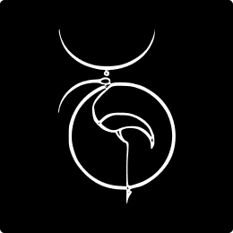

   
   
  
<h1>Julien Orjollet wd</h1>

  

<h3>
"Développeur Frontend"
</h3>

juleinorjollet.wd@gmail.com

<a href="">website</a> |  
<a href="https://github.com/CodeIsaMystic">github</a>  |  
<a href="">linkedin</a>

 
 
 

## **Sommaire**

- [**Sommaire**](#sommaire)
- [**A Propos**](#a-propos)
    - [Genèse](#genèse)
    - [Episode Covid](#episode-covid)
    - [PHP](#php)
- [**Contexte**](#contexte)
- [**Presentation**](#presentation)
    - [Après la formation](#après-la-formation)
    - [Conclusion](#conclusion)
- [**Contact**](#contact)
  - [Site web](#site-web)
  - [Mail & Réseaux sociaux](#mail--réseaux-sociaux)

 
 

## **A Propos**

Ayant réalisé la formation de développeur d'application web et mobile dans votre Academy, pour **la session live-29, sur la période de Avril-Juillet 2020**, je vous envois ce qui seraient les dossiers de mon projet de validation de cette formation.

Je n'explique pas mon retard mais **j'espère que vous puissiez comprendre les conditions** dans lesquels je me trouvais après la formation, tout comme celles d'aujourd'hui.

#### Genèse

**J'ai cherché une formation rapide il y a 3 ans** déjà, j'ai essuyé 2 refus de financements , j'ai utilisé alors mes économies afin de pouvoir accéder à ce projet de reconversion. A l'époque il n'y avait pas trop de choix de formation, du moins pas comme aujourd'hui... **Je ne savais pas ou je pouvais trouver une formation axé sur Javascript**, React ou le côté Frontend, sur un format condensé & accéléré...

#### Episode Covid

J'ai pris **la décision de m'engager avec vous, en présentiel et de façon "accéléré"**, pour pouvoir me former au métier du numérique acquierant le cursus de base, malheureusement nous n'avons TOUS eu que d'autres choix que de s'imposer un confinement, et donc pour nous, une formation à distance...

#### PHP

Pour le programme, j'étais tout à fait conscient de la formation, mais je n'avais pas idée de l'importance en terme d'heures et de travail sur la seule technologie qu'est le PHP.

Cela a été dur...

Je n'accroche pas vraiment cette technologie, il n'y a aucune volonté d'offenser, mais seulement une opinion personnelle ainsi qu'une grande passion pour Javascript.
Je reste malgré tout très content d'être passé par cela, PHP est une technologie très utilisé sur le web, avec le recul je suis très content d'avoir pu me former, me documenter sur ce langage.

J'avoue être dépassé en terme de temps et d'efforts car mon choix personnel et ma passion pour le Javascript ne m'a pas ainsi aidé à me concentrer sur PHP.

 
 

## **Contexte**

> _Je devais envoyé ce projet au jury l'année dernière. **Je suis réellement désolé de ne pas avoir pu honoré ces délais** et restant dans l'espoir que ne serait ce que vous preniez le temps d'examiner ce projet et le parcourir, je vous en serait déjà très reconnaissant.
> **Je reste tout à fait conscient des propos de ma demande**, qui plus est en retard d'un an sur les délais, je comprendrai que cela pose ainsi problème._

 
 

## **Presentation**

#### Après la formation

Après la formation, je me suis **formé spécifiquement sur javascript, gardant une approche design et continuant à apprendre de nouveaux outils, de nouveaux sujets** (git, markdown, web accessibilities, notion, trello, figma, seo...).
Je me suis **spécialisé sur React/Redux**, continuant les Data Structure, Node, Express, PostgreSQL, MongoDB...
J'ai appris à **manipuler de librairies telles que Gsap, Barbajs, styled components, axios, lodash**...
Et je taravaille aujourd'hui sur **le TDD, Typescript, les tests, React/Reux, les States management, les design systems, la documentation**.

#### Conclusion

Pour conclure cette section, je dirai qu'il m'est encore aujourd'hui très difficile de trouver ce tte motivation pour le PHP sachant que la pression augmente sur mes épaules concernant la montagne de travail que j'ai a réalisé sur ce profil de développeur Frontend Javascript React

C'est également pourquoi j'ai voulu malgré tout vous proposer un projet à petite échelle, qui se veux complet, professionnel, que j'ai par conséquent simplifié car je n'étais pas très familier avec cette écosystème. J'espère ne pas m'être tromper. J'ai fait de mon mieux vu le temps que j'ai pu y accorder. J'espère également que vous apprécierez...

 
 

## **Contact**

### Site web

Vous trouverez à cette adresse `gh-pages` une ébauche de ce qui sera mon site à l'avenir. Cela donne une idée...
J'y ai travaillé la maquette, le concept de présentation de quelques projets avec une explication technique détaillée ainsi qu'une façon d'en savoir un peu plus sur moi-même, avec mes liens de contact...
Je suis en train de travailler sur la conception de ce site, je ne sais pas encore quelles techno je vai utiliser, j'y présenterai d'autres projets je pense...

[website](https://codeisamystic.github.io/semplice-clone-portfolio/)

 
 

### Mail & Réseaux sociaux

Je ne suis présent que sur linkedIN pour l'instant et je reste actif au sein de meetups et de communautés de développeurs sur Discord.
Il faudra que je me mette sur Twitter.

Vous pouvez me joindre donc **à cette adresse mail**:
[julienorjollet.wd@gmail.com](julienorjollet.wd@gmail.com)

Mon **compte github**:
[https://github.com/CodeIsaMystic](https://github.com/CodeIsaMystic)

Et **sur mon profil linkedIN**:
[https://www.linkedin.com/in/julien-orjollet-22984516b/](https://www.linkedin.com/in/julien-orjollet-22984516b/)

 
 
